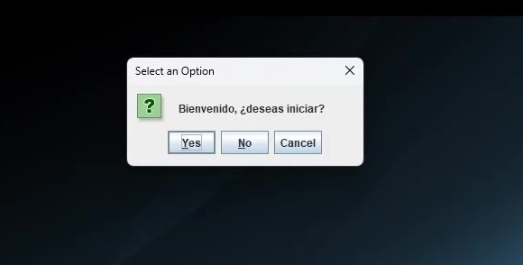

# Unit Conversion Project

[](https://search.maven.org/artifact/com.google.code.gson/gson)
[](https://search.maven.org/artifact/com.mashape.unirest/unirest-java)
[](https://search.maven.org/artifact/org.projectlombok/lombok)
[](https://search.maven.org/artifact/org.apache.logging.log4j/log4j-core)


This Java project allows you to perform unit conversions in three categories: Currency, Temperature, and Length. It provides a graphical user interface to select the conversion type and perform the conversions interactively.

[](src/media/UseExample.mp4)

## Features
- Welcome screen that prompts the user for confirmation to start.
- Menu for selecting the type of unit to convert: Currency, Temperature, or Length.
- Interactive windows for entering conversion values, selecting the initial and target units, and performing the conversions.
- Option to clear the input field.
- Option to go back to the type selection menu.
- Option to close the application entirely.
- Uses the JOptionPane library to display dialog windows.
- Requires a valid API key provided by ExchangeRate-API to perform currency conversions.

## Configuration
1. Obtain a valid API key from ExchangeRate-API, from [ExchangeRate-API](https://app.exchangerate-api.com/ "The Accurate & Reliable Exchange Rate API")
2. Inside config.json, in resources in main.java of the project, modify the following:
```
    {
        "API_KEY": "YOUR_API_KEY"
    }
```
Replace YOUR_API_KEY with your API key obtained from ExchangeRate-API.

## System Requirements
- Java JDK 8 or higher.

## Installation and Usage
1. Clone or download the project to your local machine.
2. Compile the project using the following command:
   - mvn clean compile
3. Run the project with the following command:
   - mvn exec:java
4. A welcome window will be displayed. Select "Yes" to proceed.
5. A new window will open to select the type of unit to convert (Currency, Temperature, or Length).
6. Select the unit type, and a window will open to enter the conversion values and perform the conversions.
7. Follow the on-screen instructions and use the provided buttons to interact with the application.

## Examples
- To convert currencies:
   - Run the program and select "Yes" in the welcome window.
   - Select "Currency" in the menu.
   - Enter the value to convert in the input field.
   - Select the initial and target currency units.
   - Click "Convert" to display the converted value.
   - Click "Clear" to clear the input field.
   - Click "Back" to return to the type selection menu.
   - Click "Close" to exit the application.

## Supported Units
- Currency conversions support all possible values.
- Temperature conversions support the following units:
   - Celsius
   - Fahrenheit
   - Kelvin
   - Rankine
- Length conversions support the following units:
   - km (kilometer)
   - m (meter)
   - mi (mile)
   - ft (foot)
   - in (inch)

## Obtaining an API Key
To obtain an API key, follow these steps:
1. Create an account on the ExchangeRate-API website.
2. Log in to your account and navigate to the "API Keys" section.
3. Your API key will be displayed in the menu.

## Limitations
- The free version of ExchangeRate-API allows up to 1500 requests per month. Additional plans are available on their website.
